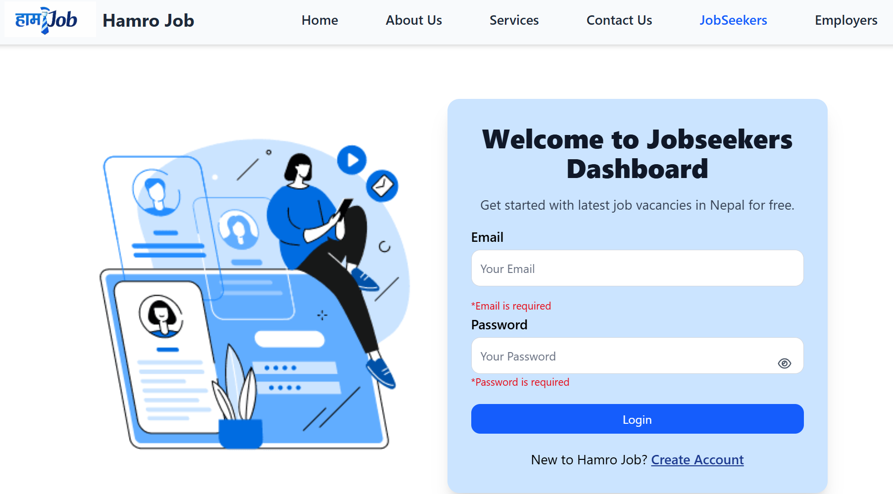
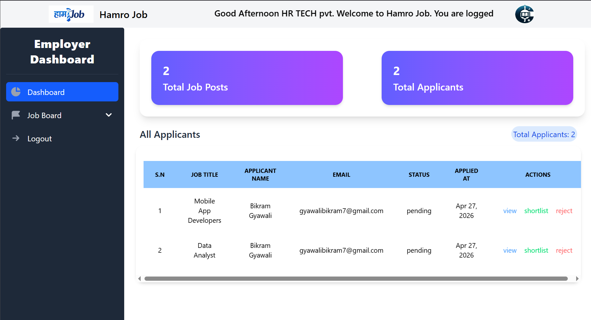
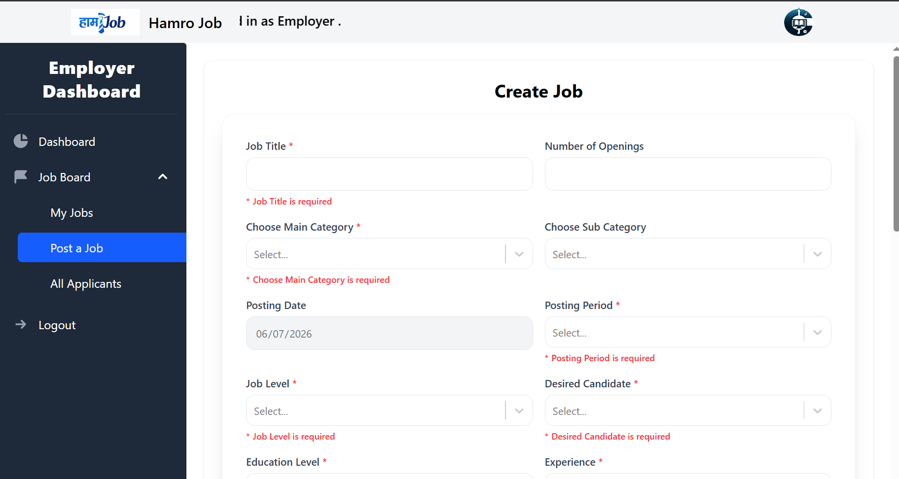
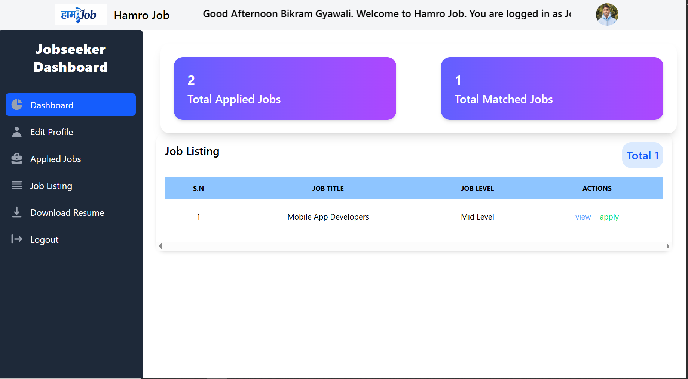
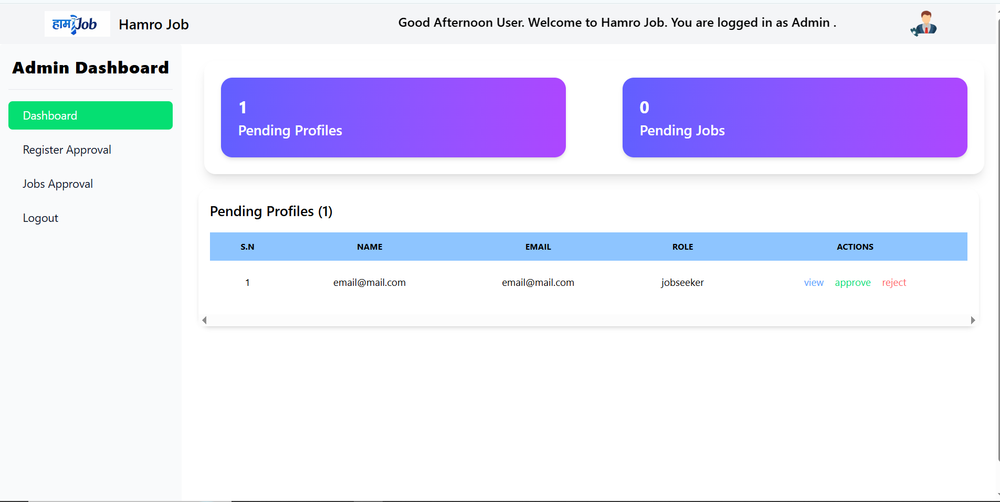

# 💼 Hamro Job — MERN Stack Job Portal

    

A modern, full-stack job portal built with the MERN stack. Connects job seekers with employers through an intuitive interface for job browsing, applications, and management.

---

## 📑 Table of Contents

- [✨ Features](#-features)
- [🛠️ Tech Stack](#️-tech-stack)
- [📋 Prerequisites](#-prerequisites)
- [⚡ Quick Start](#-quick-start)
- [🎨 Setup Guide: Flowbite & Tailwind CSS](#-setup-guide-flowbite--tailwind-css)
- [🗂️ Project Structure](#️-project-structure)
- [🔧 Environment Configuration](#-environment-configuration)
- [📸 Screenshots](#-screenshots)
- [🚀 Running the Application](#-running-the-application)
- [📝 API Endpoints](#-api-endpoints)
- [🔐 Security Features](#-security-features)
- [🤝 Contributing](#-contributing)

---

## ✨ Features

### 🔐 Authentication & Authorization

- Secure user registration and login (Job Seeker & Employer)
- JWT-based authentication with refresh tokens
- Role-based access control

### 💼 Job Management

- Browse and search job listings
- Apply for jobs with ease
- Track application status
- Manage job postings (Employers)

### 👤 User Profiles

- Comprehensive profile management
- Resume upload and management
- Job preference settings

### 📊 Dashboard

- Personalized job seeker dashboard
- Employer recruitment dashboard
- Application tracking

### 🎨 Modern UI/UX

- Responsive design with Tailwind CSS
- Beautiful components with Flowbite
- Smooth animations and transitions
- Mobile-friendly interface

---

## 🛠️ Tech Stack

### Frontend

| Package             | Purpose                     |
| ------------------- | --------------------------- |
| React 19            | UI library                  |
| Vite                | Build tool and dev server   |
| Tailwind CSS v4     | Utility-first CSS framework |
| Flowbite React      | Pre-built UI components     |
| React Router        | Client-side routing         |
| Axios               | HTTP client                 |
| React Toastify      | Toast notifications         |
| html2canvas & jsPDF | PDF generation              |

### Backend

| Package              | Purpose                  |
| -------------------- | ------------------------ |
| Node.js & Express.js | Server framework         |
| MongoDB & Mongoose   | Database and ODM         |
| JWT (jsonwebtoken)   | Authentication           |
| Bcrypt               | Password hashing         |
| Cloudinary           | Cloud image/file storage |
| Multer               | File upload handling     |
| Jest & Supertest     | Testing framework        |

---

## 📋 Prerequisites

Before you begin, make sure you have the following installed:

- **Node.js** v18 or higher — [Download](https://nodejs.org)
- **npm** — comes bundled with Node.js
- **MongoDB** (Local or Atlas) — [Download](https://www.mongodb.com/try/download/community)
- **Git** — [Download](https://git-scm.com)
- **Cloudinary Account** — [Sign up](https://cloudinary.com) (for image/file uploads)

---

## ⚡ Quick Start

### 1. Clone the Repository

```bash
git clone https://github.com/BikramGyawali/Job-Portal-Mern.git
cd Job-Portal-Mern
```

### 2. Setup Backend

```bash
cd backend
npm install
cp .env.example .env   # then fill in your environment variables
npm start
```

The backend server runs at `http://localhost:5000`

### 3. Setup Frontend

```bash
cd ../frontend
npm install
cp .env.example .env   # then fill in your environment variables
npm run dev
```

The frontend is available at `http://localhost:5173`

---

## 🎨 Setup Guide: Flowbite & Tailwind CSS

### Tailwind CSS (Pre-configured)

Tailwind CSS v4 is already configured. Relevant files:

---

## 🔧 Environment Configuration

Create a `.env` file inside `backend/` based on `.env.example`:

```env
PORT=5000
MONGO_URI=your_mongodb_connection_string
JWT_SECRET=your_jwt_secret
JWT_REFRESH_SECRET=your_refresh_secret
CLOUDINARY_CLOUD_NAME=your_cloud_name
CLOUDINARY_API_KEY=your_api_key
CLOUDINARY_API_SECRET=your_api_secret
CLIENT_URL=http://localhost:5173
```

Create a `.env` file inside `frontend/` based on `.env.example`:

```env
VITE_API_URL=http://localhost:5000
```

---

## 📸 Screenshots

<!-- Replace the paths below with your actual image paths or URLs -->

### Home Page


_Landing page with features overview and call-to-action_

### About Page


_Platform mission and information_

### Login Page


_Secure login for job seekers and employers_

### Employer Dashboard


_Manage your applications and profile_

### Job-Post Page


_Post jobs on hamro job_

### Jobseeker Dashboard


_Manage your jobs and profile_

### Admin Dashboard


_Manage your jobs, profile and applicants _

---

## 🚀 Running the Application

### Development Mode

**Terminal 1 — Backend:**

```bash
cd backend
npm start
```

**Terminal 2 — Frontend:**

```bash
cd frontend
npm run dev
```

Open `http://localhost:5173` in your browser.

### Production Build

```bash
cd frontend
npm run build
npm run preview
```

---

## 🧪 Testing

**Backend Tests:**

```bash
cd backend
npm test
```

**Frontend Linting:**

```bash
cd frontend
npm run lint
```

---

## 📝 API Endpoints

Full documentation with request/response examples is available on Postman:

**[📖 View API Documentation →](https://documenter.getpostman.com/view/38226013/2sBXqNmJAQ)**

### Authentication

| Method | Endpoint                  | Description       |
| ------ | ------------------------- | ----------------- |
| POST   | `/api/auth/register`      | Register new user |
| POST   | `/api/auth/login`         | User login        |
| POST   | `/api/auth/logout`        | User logout       |
| POST   | `/api/auth/refresh-token` | Refresh JWT token |

### Jobs

| Method | Endpoint        | Description               |
| ------ | --------------- | ------------------------- |
| GET    | `/api/jobs`     | Get all job listings      |
| GET    | `/api/jobs/:id` | Get specific job          |
| POST   | `/api/jobs`     | Create new job (Employer) |
| PUT    | `/api/jobs/:id` | Update job (Employer)     |
| DELETE | `/api/jobs/:id` | Delete job (Employer)     |

### Applications

| Method | Endpoint                | Description               |
| ------ | ----------------------- | ------------------------- |
| POST   | `/api/applications`     | Apply for a job           |
| GET    | `/api/applications`     | Get user applications     |
| GET    | `/api/applications/:id` | Get application details   |
| PUT    | `/api/applications/:id` | Update application status |

### Users

| Method | Endpoint                   | Description         |
| ------ | -------------------------- | ------------------- |
| GET    | `/api/users/profile`       | Get user profile    |
| PUT    | `/api/users/profile`       | Update user profile |
| POST   | `/api/users/upload-resume` | Upload resume       |

---

## 🔐 Security Features

| Feature             | Implementation                       |
| ------------------- | ------------------------------------ |
| Password Encryption | Bcrypt hashing                       |
| Authentication      | JWT with refresh tokens              |
| CORS Protection     | Configured origin allowlist          |
| Input Validation    | Server-side validation on all inputs |
| Error Handling      | Centralized error handler middleware |
| Secrets Management  | Environment variables via dotenv     |

---

## 🤝 Contributing

Contributions are welcome! Please follow these steps:

1. **Fork** the repository
2. **Create** a feature branch: `git checkout -b feature/YourFeature`
3. **Commit** your changes: `git commit -m 'Add YourFeature'`
4. **Push** to the branch: `git push origin feature/YourFeature`
5. **Open** a Pull Request

---

## 👨‍💻 Author

**Bikram Gyawali**

- 🌐 Portfolio: [bikramgyawali.com.np](https://bikramgyawali.com.np)
- 🐙 GitHub: [@BikramGyawali](https://github.com/BikramGyawali)

---

## 🙏 Acknowledgments

- [React Documentation](https://react.dev)
- [Tailwind CSS](https://tailwindcss.com)
- [Flowbite](https://flowbite.com)
- [Express.js](https://expressjs.com)
- [MongoDB](https://www.mongodb.com)

---

> ⭐ If you found this project helpful, consider giving it a star on GitHub!

_Made with ❤️ by Bikram Gyawali_
